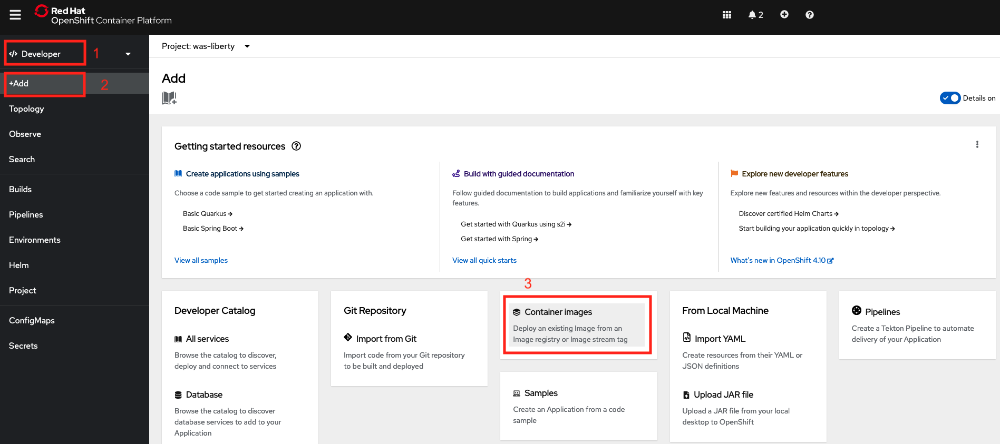

# Websphere Liberty: Load Balance the MQ Traffic to Multiple Queue Managers using CCDT

This guide will take you through the process of setting up the Client Channel Definition Table (CCDT), and deploying IBM WebSphere Liberty on OpenShift. We'll conclude with configuring WAS Liberty to use the CCDT and testing our setup. 

**The following files will be required:**
- **Dockerfile:** This file contains the set of instructions to build the Docker image.
- **was-mq-aa-sample.war:** This is the Web Application Archive (WAR) file that will be deployed to the WebSphere Application Server (WAS) Liberty.
- **ccdt.json:** This JSON file contains the CCDT information required for WAS Liberty to interact with IBM MQ.
- **server.xml:** This is the primary configuration file for the WAS Liberty.


**Pre-requisites:**

Please note that the guide has been written and tested with the following specific versions of software and conditions. While other versions or configurations may work, these are the tested and confirmed requirements:

- Red Hat Enterprise Linux (RHEL) 9.2 with the following installed:
	- IBM MQ v9.3.3
	- Podman version 4.4.1
	- oc command line 4.10 installed on RHEL
- Network connectivity allowed from the Linux server to the OCP cluster, and from the ocp worker nodes to the linux server
- Red Hat OpenShift Cluster already installed and configured (this guide uses OCP v4.10)

### Installing IBM MQ on Linux

This guide uses RPM on a fresh linux server to create the mqm user ID and group, with a home directory of /var/mqm, as part of the installation procedure. The following links provide detailed steps on how to prepare your Linux system, install IBM MQ, and verify the installation.


#### Further Reading

- [Preparing the system on Linux](https://www.ibm.com/docs/en/ibm-mq/9.3?topic=linux-preparing-system).
- [Installing the first IBM MQ installation on Linux using the rpm command](https://www.ibm.com/docs/en/ibm-mq/9.3?topic=imlur-installing-first-mq-installation-linux-using-rpm-command).
- [Verifying a local server installation using the command line on Linux](https://www.ibm.com/docs/en/ibm-mq/9.3?topic=vmil-verifying-local-server-installation-using-command-line-linux): Create 2 Queue Managers following the same steps. This is to demonistrate the load balancing on two Active Queue Managers.
- [DEFINE LISTENER (define a new listener)](https://ibm.com/docs/en/ibm-mq/9.3?topic=reference-define-listener-define-new-listener-multiplatforms).
- [START LISTENER (Start the newly created listener)](https://www.ibm.com/docs/en/ibm-mq/9.3?topic=reference-start-listener-start-channel-listener): use different ports in each queue manager. For example one at `1414` and another at `1416`.

The following commands disable the Channel Authentication (CHLAUTH) and the Connection Authentication (CONNAUTH) features of the Queue Managers. To be able to execute the commands, you must execute `runmqsc <queue manager name>` first:


```
ALTER QMGR CHLAUTH(DISABLED)
ALTER QMGR CONNAUTH(' ')
REFRESH SECURITY
```

**Note:** This configuration is for demonstration purposes only and is not intended for use in a production environment. In a production environment, a high level of security is needed, and thus the disabling of these authentication features is typically not recommended. Always follow best security practices when configuring your Queue Managers for production use. 


### Configure CCDT

The Client Channel Definition Table (CCDT) contains definitions of the channels that applications use to connect to Queue Managers.

```json
{
  "channel": 
  [
      {
          "name": "SYSTEM.DEF.SVRCONN",
          "clientConnection": 
          {
              "connection": 
              [
                  {
                      "host": "xxx.xxx.xxx.xxx",
                      "port": 1414
                  }
              ],
              "queueManager": "QMGRP"
          },
          "connectionManagement":
          {
            "clientWeight": 1,
            "affinity": "none"
          },
          "type": "clientConnection"
      },
      {
          "name": "SYSTEM.DEF.SVRCONN",
          "clientConnection": 
          {
              "connection": 
              [
                  {
                      "host": "xxx.xxx.xxx.xxx",
                      "port": 1416
                  }
              ],
              "queueManager": "QMGRP"
          },
          "connectionManagement":
          {
            "clientWeight": 1,
            "affinity": "none"
          },
          "type": "clientConnection"
      }
 ]
}
```

Replace xxx.xxx.xxx.xxx with the IP address of the server running your IBM MQ. 

**Note:** we are using `QMGRP` as the queue manager name for all `queueManager` entries. With the `connectionManagement` configured, WAS Liberty will be able to connect to both queue managers and will distribute the connection for load balancing. 

#### Further Reading

- [Configuring client channel definition tables](https://www.ibm.com/docs/en/ibm-mq/9.3?topic=server-configuring-client-channel-definition-tables)

- [JSON CCDT examples](https://www.ibm.com/docs/en/ibm-mq/9.3?topic=ccdt-json-examples)
- [Using IBM MQ CCDT file in JSON format](https://www.ibm.com/support/pages/system/files/inline-files/Using%20IBM%20MQ%20CCDT%20file%20in%20JSON%20format_2.pdf) 


### Deploy IBM WebSphere Liberty on OpenShift

**Note:** If your organization maintains an enterprise container registry, you can bypass this section involved in creating a local image registry on your Linux server using Podman. An enterprise container registry is designed to securely store and manage the Docker images used by your organization. It typically provides features like access controls, image vulnerability scanning, and audit logs, that ensure high levels of security and governance. In such a scenario, instead of pushing the Docker images to a local registry, you directly push them to your enterprise container registry. This simplifies the workflow and leverages the robust infrastructure of your enterprise registry, eliminating the need for maintaining a local image registry on the Linux server.

#### Create the local image registry on the Linux server using podman

Run the image registry by executing the following command: 
```shell
podman run -d -p 5000:5000 --name=registry -v /home/docker/registry:/var/lib/registry --restart=always registry:2
```

edit the `registries.conf` file:

```shell
sudo vim /etc/containers/registries.conf
```

add the following lines to allow insecure connection to the registry
```shell
#allowing insecure connection to the local registry
[[registry]]
location = "localhost:5000"
insecure = true
```


#### Further Reading
- [IBM MQ messaging provider](https://www.ibm.com/docs/en/was-liberty/base?topic=providers-mq-messaging-provider) 
- [Running WebSphere Liberty in a container](https://www.ibm.com/docs/en/was-liberty/base?topic=running-websphere-liberty-in-container)

###  WAS Liberty Implementation to Connect to the IBM Queue Managers


#### Java Maven Project to implement a HttpServlet application 

This guide uses the Java Maven framework to build the `SendMessageServlet.java` class and create the `was-mq-aa-sample.war` file. This is a HttpServlet application that listens on http with /SendMessage path then sends a message to a aueue using the javax.JMS library.  

**SendMessageServlet.java Class:**

```java
package ibm.tech.demo.was.mq.aa;

import java.io.IOException;
import javax.annotation.Resource;
import javax.jms.ConnectionFactory;
import javax.jms.JMSContext;
import javax.jms.Queue;
import javax.servlet.annotation.WebServlet;
import javax.servlet.http.HttpServlet;
import javax.servlet.http.HttpServletRequest;
import javax.servlet.http.HttpServletResponse;

/**
 * The SendMessageServlet class uses the Javax library to send a message to IBM MQ.
 * The purpose of this is to demonistrate load balancing the message sent to 2 queue managers
 */
@WebServlet("/SendMessage")
public class SendMessageServlet extends HttpServlet {

    @Resource(lookup = "jms/CF")
    private ConnectionFactory connectionFactory;

    @Resource(lookup = "jms/Q1")
    private Queue queue;

    @Override
    protected void doGet(HttpServletRequest req, HttpServletResponse resp) throws IOException {
        try (JMSContext jmsContext = connectionFactory.createContext()) {
            jmsContext.createProducer().send(queue, "Hello, IBM MQ!");
        }
        resp.getWriter().write("Message sent!");
    }
}

```

#### Create the server.xml File

In this step, we are creating the configuration file for the WAS Liberty. The server.xml file includes the features that the server is going to use, the http endpoint that will trigger the HttpServlet application, and the MQ connection details. Notice that we are specifying `*QMGRP` for all queue manager names. This will allow the server to connect to any queue manager within the CCDT file. The ccdt file is also referenced at the `file:///opt/wmq/ccdt.json` file path.

Note: in WAS Liberty running in containers, the resource adapter used to connect to IBM MQ is not included by default. This is to follow the best practices of making the container light waight. In our case we need to install this adapter and include copy it to the container using the Dockerfile. For more information, check the [Installing the resource adapter in Liberty](https://www.ibm.com/docs/en/ibm-mq/9.3?topic=adapter-installing-resource-in-liberty) documentation. 

**server.xml File: **

```xml
<server description="new server">

    <featureManager>
        <feature>jsp-2.3</feature>
        <feature>localConnector-1.0</feature>
        <feature>transportSecurity-1.0</feature>
        <feature>jms-2.0</feature>
        <feature>wmqJmsClient-2.0</feature>
        <feature>jndi-1.0</feature>
    </featureManager>

    <httpEndpoint id="defaultHttpEndpoint"
                  host="*"
                  httpPort="9080"
                  httpsPort="9443" />

    <variable name="wmqJmsClient.rar.location"                    
        value="/opt/wmq/wmq.jmsra.rar"/>

<jmsConnectionFactory jndiName="jms/CF" connectionManagerRef="ConMgr6">
     <properties.wmqJms 
        ccdtURL="file:///opt/wmq/ccdt.json" 
        queueManager="*QMGRP"/>
</jmsConnectionFactory>
<connectionManager id="ConMgr6" maxPoolSize="2"/>

<jmsQueue id="jms/Q1" jndiName="jms/Q1">
     <properties.wmqJms 
        baseQueueName="QUEUE1" 
        targetClient="MQ"/>
    </jmsQueue>

</server>
```

#### Build the docker container image

Create the below Dockerfile: 

```Dockerfile 
FROM icr.io/appcafe/websphere-liberty:kernel-java11-openj9-ubi

#Installing network tools for troubleshooting purposes 
USER root

RUN yum install -y net-tools && \
    yum clean all
#Creating the directory to copy the mq resource adapter 
RUN mkdir -p /opt/wmq/
RUN chmod 775 /opt/wmq

USER 1001

COPY wmq.jmsra.rar /opt/wmq/

COPY ccdt.json /opt/wmq/
# Default setting for the verbose option. Set it to true to debug the application container image build failures
ARG VERBOSE=false

# Add Liberty server configuration including all necessary features
COPY --chown=1001:0  server.xml /config/

# Modify feature repository (optional)
#COPY --chown=1001:0 featureUtility.properties /opt/ibm/wlp/etc/

# This script will add the requested XML snippets to enable Liberty features and grow the image to be fit-for-purpose using featureUtility.
RUN features.sh

# Add interim fixes (optional)
#COPY --chown=1001:0  interim-fixes /opt/ibm/fixes/

# Add application
COPY --chown=1001:0  was-mq-aa-sample.war /config/dropins/

#Expose the application port
EXPOSE 9080
#EXPOSE 9443
# This script will add the requested server configurations, apply any interim fixes and populate caches to optimize runtime
RUN configure.sh
```

On the Linux server where you have installed podman and docker registry created, copy the created Dockerfile, server.xml, ccdt.json, java application WAR file and the mq adapter file to a workspace location in the server. For example:

```shell
[user1@rhel-server was-mq-aa]# pwd
/workspace/was-mq-aa/

[user1@rhel-server was-mq-aa]# ls
ccdt.json  Dockerfile server.xml  was-mq-aa-sample.war  wmq.jmsra.rar
```

Build the container image from the Dockerfile:

```
cd /workspace/was-mq-aa/

podman build -t localhost:5000/was-mq-aa:latest .
```


#### Further Reading

- [Deploying JMS applications to Liberty to use the IBM MQ messaging provider](https://www.ibm.com/docs/en/was-liberty/base?topic=SSEQTP_liberty/com.ibm.websphere.wlp.nd.multiplatform.doc/ae/twlp_dep_msg_wmq.htm)
- [JMS Queue Connection Factory (jmsQueueConnectionFactory) - properties.wmqJms](https://www.ibm.com/docs/en/was-liberty/base?topic=configuration-jmsqueueconnectionfactory#properties.wmqJms)


### Deploy Websphere Liberty Container on Red Hat OpenShift

Login to the Red Hat OpenShift web console, and create a new project if needed. For example `was-liberty`.


" data-align="center">

Switch to the developer view, and click on the +Add tab. 

" data-align="center">

Enter the ip address, port, and image tag in the image name as shown below. Make sure that *Allow Images from insecure registries* is selected. 

" data-align="center">

Wait until the image is pulled from the image registry, and all containers within the pod is in the running state. Adding the contair username to the mqm group for MQ might be needed to avoid authentication issues. 

By now you should have the Websphere Application Server Liberty deployed on Openshift, and its HTTP endpoint is ready to be invoked on the `/was-mq-aa-sample/SendMessage` endpoint. The final step is to test the application and make sure that the connection is load balanced accross the two queue managers. 

### Test the Setup

Open 4 different command line terminals windows. Two will be used to execute curl command to send messages and the other two will be for reading the messages


Before executing the curl: 

" data-align="center">

After executing the curl: 

" data-align="center">
 


### Disclaimer 
- The setup detailed in this guide is intended primarily for testing and development purposes and may not be suitable for production environments without further adjustments and refinements.
- The use of the IBM MQ classes for Java within a Java EE environment is supported with restrictions. For information about these restrictions, see [Running IBM MQ classes for Java applications within Java EE](https://www.ibm.com/docs/en/SSFKSJ_9.2.0/com.ibm.mq.dev.doc/q031490_.html).
- [IBM MQ resource adapter statement of support](https://www.ibm.com/docs/en/ibm-mq/9.2?topic=adapter-mq-resource-statement-support#q128150_)